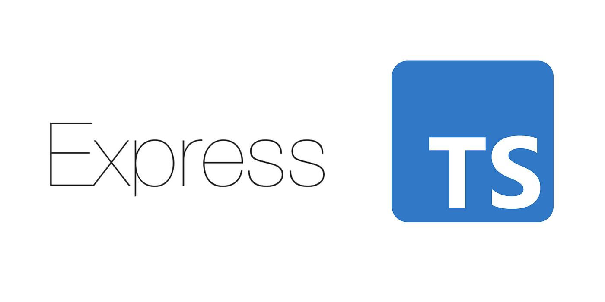

## Node with Ts with Expressjs



Setting node js server with Typescript

```bash
    cd <your directory>
    mkdir project-name
    cd project-name
```
- node app setup
```bash
    npm init 
    npm i typescript -D
    npm i express 
    npm i -D @types/express
    npx tsc --init
```

- tsconfig.json
```json
{
  "compilerOptions": {
    "target": "es2016",                                  
    "rootDir": "./src",                     
    "outDir": "./build",                               
    "strict": true,                                                      
    "skipLibCheck": true                            
  }
}
```

- to complie and run the application
```bash
    npm i tsc-watch -D
```

- package.json and changing the scripts
```json
    {
        "scripts":{
            "start":"node ./build/index.js",
            "dev":"tsc-watch --onSuccess \"npm run start\""
        }
    }
```
