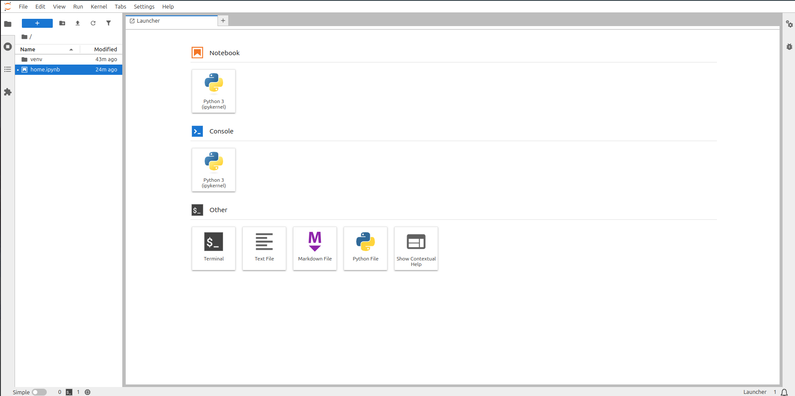

# Jupyter lab setup in virtual environment
----------------------------------------------

To setup the juypter lab in virtual environment
```bash
python3 -m venv venv
source venv/bin/activate
```

install juypter lab
```bash
# upgrade pip and other dependencies
python -m pip install --upgrade pip

# install the jupyter lab
pip install jupyterlab
jupyter lab

# open the juypter lab in browser the link is porvided in terminal
```

The output will look like this below image
